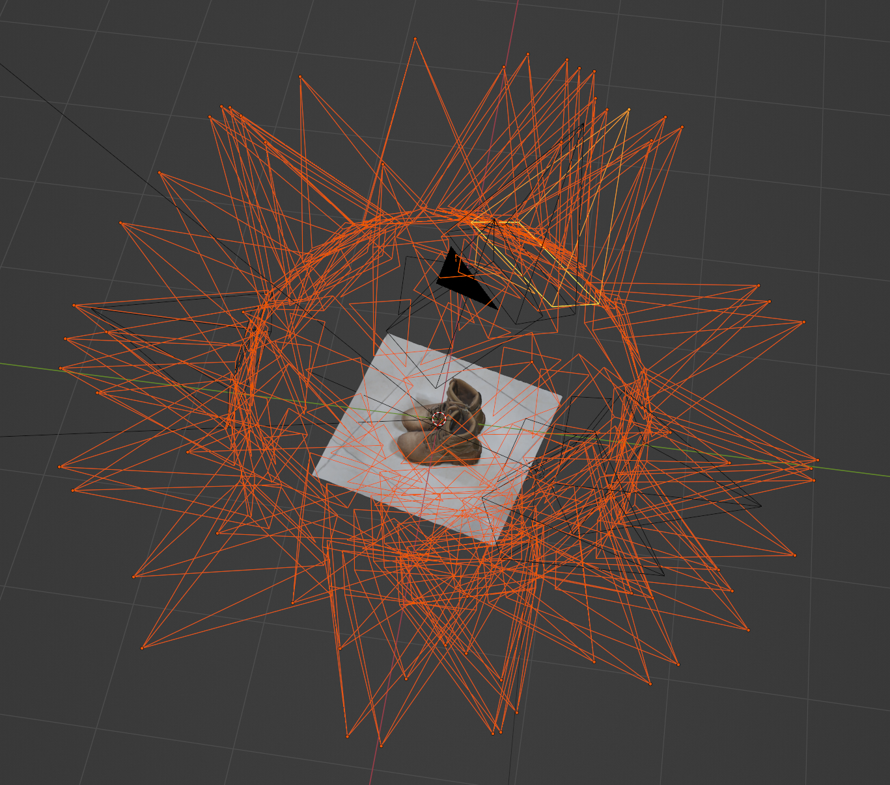
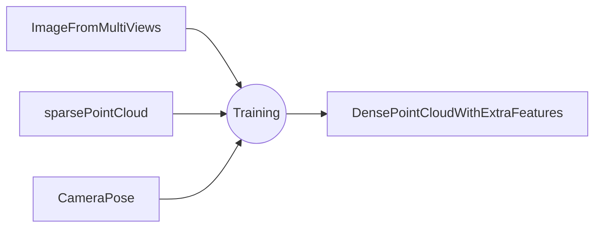
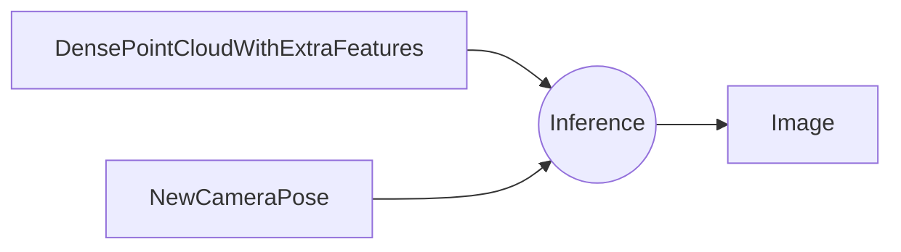
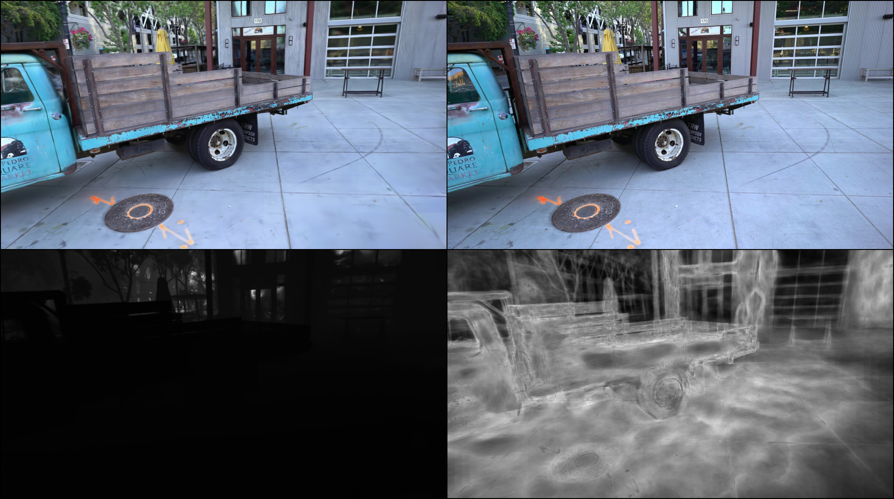
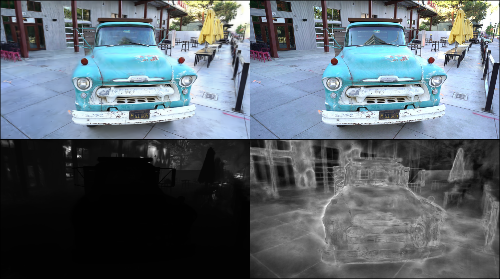
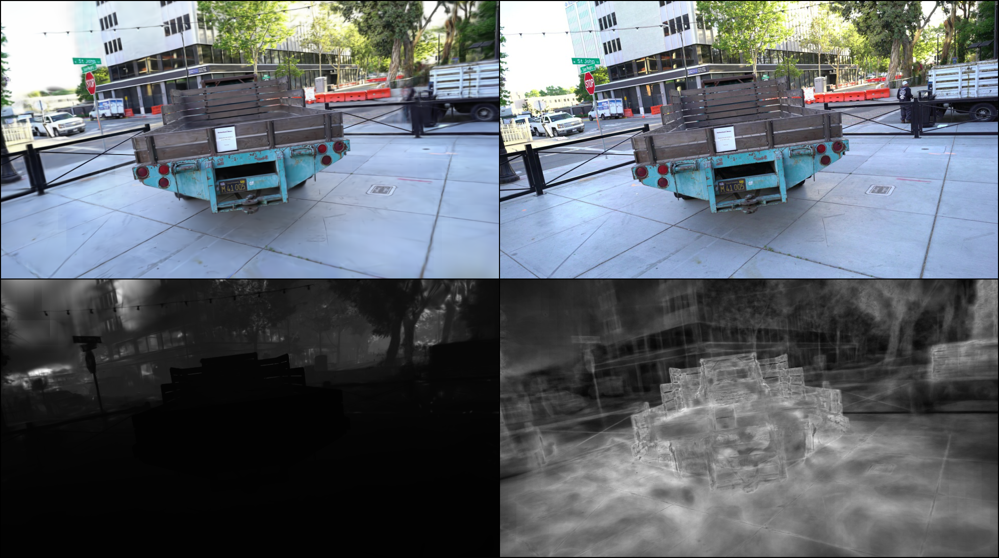
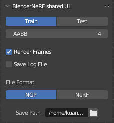
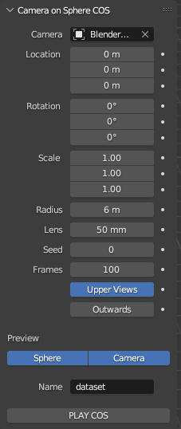
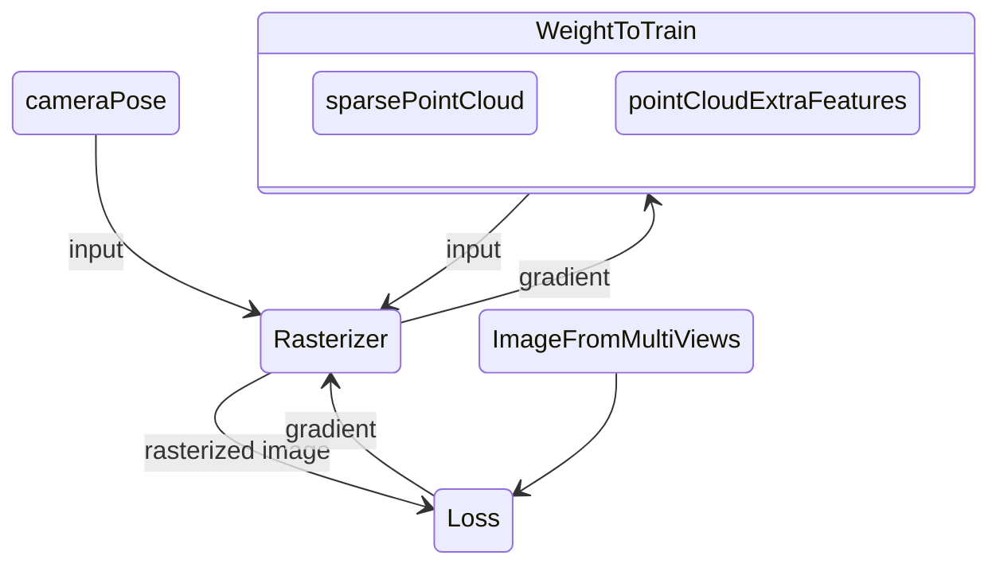

# taichi_3d_gaussian_splatting
An unofficial implementation of paper [3D Gaussian Splatting
for Real-Time Radiance Field Rendering](https://repo-sam.inria.fr/fungraph/3d-gaussian-splatting/) by taichi lang. 

## What does 3D Gaussian Splatting do?

### Training:
The algorithm takes image from multiple views, a sparse point cloud, and camera pose as input, use a differentiable rasterizer to train the point cloud, and output a dense point cloud with extra features(covariance, color information, etc.).

\
If we view the training process as module, it can be described as:


### Inference:
The algorithm takes the dense point cloud with extra features and any camera pose as input, use the same rasterizer to render the image from the camera pose.

An example of inference result:

https://github.com/wanmeihuali/taichi_3d_gaussian_splatting/assets/18469933/cc760693-636b-4157-ae85-33813f3da54d

Because the nice property of point cloud, the algorithm easily handles scene/object merging compared to other NeRF-like algorithms.

https://github.com/wanmeihuali/taichi_3d_gaussian_splatting/assets/18469933/bc38a103-e435-4d35-9239-940e605b4552


<details><summary>other example result</summary>
<p>

top left: [result from this repo(30k iteration)](https://github.com/wanmeihuali/taichi_3d_gaussian_splatting/blob/cf7c1428e8d26495a236726adf9546e4f2a9adb7/config/tat_truck_every_8_test.yaml), top right: ground truth, bottom left: normalized depth, bottom right: normalized num of points per pixel




</p>
</details>

## Why taichi?
- Taichi is a language for high-performance computing. It is designed to close the gap between the productivity-focused Python language and the performance- and parallelism-focused C++/CUDA languages. By using Taichi, the repo is pure Python, and achieves the same or even better performance compared to CUDA implementation. Also, the code is much easier to read and maintain.
- Taichi provides various backends, including CUDA, OpenGL, Metal, etc. We do plan to change the backend to support various platforms, but currently, the repo only supports CUDA backend.
- Taichi provides automatic differentiation, although the repo does not use it currently, it is a nice feature for future development. 

## Current status
The repo is now tested with the dataset provided by the official implementation. For the truck dataset, The repo is able to achieve a bit higher PSNR than the official implementation with only 1/5 to 1/4 number of points. However, the training/inference speed is still slower than the official implementation. 

The results for the official implementation and this implementation are tested on the same dataset. I notice that the result from official implementation is slightly different from their paper, the reason may be the difference in testing resolution.

| Dataset | source | PSNR | SSIM | #points |
| --- | --- | --- | --- | --- |
| Truck(7k) | paper | 23.51 | 0.840 | - |
| Truck(7k) | offcial implementation | 23.22 | - | 1.73e6 |
| Truck(7k) | this implementation | 23.762359619140625 | 0.835700511932373 | ~2.3e5 |
| Truck(30k) | paper | 25.187 | 0.879 | - |
| Truck(30k) | offcial implementation | 24.88 | - | 2.1e6 |
| Truck(30k) | this implementation | 25.21463966369629 | 0.8645088076591492 | 428687.0 |

[Truck(30k)(recent best result)](https://github.com/wanmeihuali/taichi_3d_gaussian_splatting/pull/98#issuecomment-1634828783):
| train:iteration | train:l1loss | train:loss | train:num_valid_points | train:psnr | train:ssim | train:ssimloss | val:loss | val:psnr | val:ssim |
| --- | --- | --- | --- | --- | --- | --- | --- | --- | --- |
| 30000.0 | 0.02784738875925541 | 0.04742341861128807 | 428687.0 | 25.662137985229492 | 0.8742724657058716 | 0.12572753429412842 | 0.05369199812412262 | 25.21463966369629 | 0.8645088076591492 |


## Installation
1. Prepare an environment contains pytorch and torchvision
2. clone the repo and cd into the directory.
3. run the following command
```
pip install -r requirements.txt
pip install -e .
```

All dependencies can be installed by pip. pytorch/tochvision can be installed by conda. The code is tested on Ubuntu 20.04.2 LTS with python 3.10.10. The hardware is RTX 3090 and CUDA 12.1. The code is not tested on other platforms, but it should work on other platforms with minor modifications.

## Dataset
The algorithm requires point cloud for whole scene, camera parameters, and ground truth image. The point cloud is stored in parquet format. The camera parameters and ground truth image are stored in json format. The running config is stored in yaml format. A script to build dataset from colmap output is provided. It is also possible to build dataset from raw data.
### Train on Tank and temple Truck scene
<details><summary>CLICK ME</summary>
<p>
**Disclaimer**: users are required to get permission from the original dataset provider. Any usage of the data must obey the license of the dataset owner.

The truck scene in [tank and temple](https://www.tanksandtemples.org/download/) dataset is the major dataset used to develop this repo. We use a downsampled version of images in most experiments. The camera poses and the sparse point cloud can be easily generated by colmap. The preprocessed image, pregenerated camera pose and point cloud for truck scene can be downloaded from this [link](https://drive.google.com/drive/folders/1ZhMSkm3YGfhtywII5Hik5YDdMzD3lZjX?usp=sharing
).

Please download the images into a folder named `image` and put it under the root directory of this repo. The camera poses and sparse point cloud should be put under `data/tat_truck_every_8_test`. The folder structure should be like this:
```
├── data
│   ├── tat_truck_every_8_test
│   │   ├── train.json
│   │   ├── val.json
│   │   ├── point_cloud.parquet
├── image
│   ├── 000000.png
│   ├── 000001.png
```
the config file [config/tat_truck_every_8_test.yaml](config/tat_truck_every_8_test.yaml) is provided. The config file is used to specify the dataset path, the training parameters, and the network parameters. The config file is self-explanatory. The training can be started by running
```bash
python gaussian_point_train.py --train_config config/tat_truck_every_8_test.yaml
```
</p>
</details>


### Train on Example Object(boot)

<details><summary>CLICK ME</summary>
<p>

It is actually one random free mesh from [Internet](https://www.turbosquid.com/3d-models/3d-tactical-boots-1948918), I believe it is free to use. [BlenderNerf](https://github.com/maximeraafat/BlenderNeRF.git) is used to generate the dataset. The preprocessed image, pregenerated camera pose and point cloud for boot scene can be downloaded from this [link](https://drive.google.com/drive/folders/1d14l9ewnyI7zCA6BxuQUWseQbIKyo3Jh?usp=sharing). Please download the images into a folder named `image` and put it under the root directory of this repo. The camera poses and sparse point cloud should be put under `data/boots_super_sparse`. The folder structure should be like this:
```
├── data
│   ├── boots_super_sparse
│   │   ├── boots_train.json
│   │   ├── boots_val.json
│   │   ├── point_cloud.parquet
├── image
│   ├── images_train
│   │   ├── COS_Camera.001.png
│   │   ├── COS_Camera.002.png
|   |   ├── ...
```
Note that because the image in this dataset has a higher resolution(1920x1080), training on it is actually slower than training on the truck scene.


</p>
</details>


### Train on dataset generated by colmap
<details><summary>CLICK ME</summary>
<p>
    
- Reconstruct using colmap: See https://colmap.github.io/tutorial.html. The image should be undistorted. Sparse reconstruction is usually enough.
- save as txt: the standard colmap txt output contains three files, cameras.txt, images.txt, points3D.txt
- transform the txt into json and parquet: see [this file](tools/prepare_colmap.py) about how to prepare it.
- prepare config yaml: see [this file](config/tat_train.yaml) as an example
- run with the config.

</p>
</details>

### Train on dataset with Instant-NGP format with extra mesh
<details><summary>CLICK ME</summary>
<p>

- A script to convert Instant-NGP format dataset into the two required JSON files is provided. However, the algorithm requires an extra point cloud as input, which does not usually come with Instant-NGP format dataset. The script accepts a mesh file as input and generate a point cloud by sampling points on the mesh. The script is [here](tools/prepare_InstantNGP_with_mesh.py).
- User can run the script with the following command:
```bash
python tools/prepare_InstantNGP_with_mesh.py \
    --transforms_train {path to train transform file} \
    --transforms_test {path to val transform file, if not provided, val will be sampled from train} \
    --mesh_path {path to mesh file} \
    --mesh_sample_points {number of points to sample on the mesh} \
    --val_sample {if sample val from train, sample by every n frames} \
    --image_path_prefix {path prefix to the image, usually the path to the folder containing the image folder} \
    --output_path {path to output folder}
```
- then in the output folder, there will be two json files, train.json and val.json, and a point cloud file point_cloud.parquet. 
- create a config yaml file similar to [test_sagemaker.yaml](config/test_sagemaker.yaml), modify train-dataset-json-path to the path of train.json, val-dataset-json-path to the path of val.json, and pointcloud-parquet-path to the path of point_cloud.parquet. Also modify the summary-writer-log-dir and output-model-dir to where ever you want to save the model and tensorboard log.
- run with the config:
```bash
python gaussian_point_train.py --train_config {path to config yaml}
```

</p>
</details>

### Train on dataset generated by BlenderNerf
<details><summary>CLICK ME</summary>
<p>

[BlenderNerf](https://github.com/maximeraafat/BlenderNeRF.git) is a Blender Plugin to generate dataset for NeRF. The dataset generated by BlenderNerf can be the Instant-NGP format, and we can use the [script](tools/prepare_InstantNGP_with_mesh.py) to convert it into the required format. And the mesh can be easily exported from Blender. To generate the dataset:
- Install [Blender](https://www.blender.org/)
- import the mesh/scene you want to [Blender](https://www.blender.org/)
- Install BlenderNerf by following the README in [BlenderNerf](https://github.com/maximeraafat/BlenderNeRF.git)
- config BlenderNerf: make sure Train is selected and Test is not selected(Test seems to be buggy), File Format is NGP, save path is filled.\

- config BlenderNerf Camera on Sphere: follow BlenderNerf README to config the camera(default is enough for most case). Then click PLAY COS.\
 
- A zip file will be generated in the save path. Unzip it, it should contain a folder named `train` and a file named `transforms_train.json`.
- In Blender, File->Export->Stl(.stl), export the mesh as stl file.
- can run the [script](tools/prepare_InstantNGP_with_mesh.py) with the following command:
```bash
python tools/prepare_InstantNGP_with_mesh.py \
    --transforms_train {path to transform_train.json} \
    --mesh_path {path to stl file} \
    --mesh_sample_points {number of points to sample on the mesh, default to be 500} \
    --val_sample {if sample val from train, sample by every n frames, default to be 8} \
    --image_path_prefix {absolute path of the directory contain the train dir} \
    --output_path {any path you want}
```
- then in the output folder, there will be two json files, train.json and val.json, and a point cloud file point_cloud.parquet.
- create a config yaml file similar to [test_sagemaker.yaml](config/test_sagemaker.yaml), modify train-dataset-json-path to the path of train.json, val-dataset-json-path to the path of val.json, and pointcloud-parquet-path to the path of point_cloud.parquet. Also modify the summary-writer-log-dir and output-model-dir to where ever you want to save the model and tensorboard log.
- run with the config:
```bash
python gaussian_point_train.py --train_config {path to config yaml}
```

</p>
</details>

### Train on dataset generated by other methods
<details><summary>CLICK ME</summary>
<p>

see [this file](docs/RawDataFormat.md) about how to prepare the dataset.

</p>
</details>


 
## Run
```bash
python gaussian_point_train.py --train_config {path to config file}
```

The training process works in the following way:


The result is visualized in tensorboard. The tensorboard log is stored in the output directory specified in the config file. The trained point cloud with feature is also stored as parquet and the output directory is specified in the config file.

### Run on colab (to take advantage of google provided GPU accelerators)
You can find the related notebook here: [/tools/run_3d_gaussian_splatting_on_colab.ipynb](/tools/run_3d_gaussian_splatting_on_colab.ipynb)

1. Set the hardware accelerator in colab: "Runtime->Change Runtime Type->Hardware accelerator->select GPU->select T4"
2. Upload this repo to corresponding folder in your google drive.
3. Mount your google drive to your notebook (see notebook).
4. Install condacolab (see notebook).
5. Install requirement.txt with pip (see notebook).
6. Install pytorch, torchvision, pytorch-cuda etc. with conda (see notebook).
7. Prepare the dataset as instructed in https://github.com/wanmeihuali/taichi_3d_gaussian_splatting#dataset
8. Run the trainer with correct config (see notebook).
9. Check out the training process through tensorboard (see notebook).

## Visualization
A simple visualizer is provided. The visualizer is implemented by Taichi GUI which limited the FPS to 60(If anyone knows how to change this limitation please ping me). The visualizer takes one or multiple parquet results. Example parquets can be downloaded [here](https://drive.google.com/file/d/12-kZZay8RFlDk7hJQysG_Cr4-oxDp37l/view?usp=sharing).
```bash
python3 visualizer --parquet_path_list <parquet_path_0> <parquet_path_1> ...
```
The visualizer merges multiple point clouds and displays them in the same scene.
- Press 0 to select all point clouds(default state).
- Press 1 to 9 to select one of the point clouds.
- When all point clouds are selected, use "WASD=-" to move the camera, and use "QE" to rotate by the y-axis, or drag the mouse to do free rotation.
- When only one of the point clouds is selected, use "WASD=-" to move the object/scene, and use "QE" to rotate the object/scene by the y-axis, or r drag the mouse to do free rotation by the center of the object.

## How to contribute/Use CI to train on cloud

I've enabled CI and cloud-based training now. The function is not very stable yet. It enables anyone to contribute to this repo even if you don't have a GPU.
Generally, the workflow is:
1. For any algorithm improvement, please create a new branch and make a pull request.
2. Please @wanmeihuali in the pull request, and I will check the code and add a label `need_experiment` or `need_experiment_garden` or `need_experiment_tat_truck` to the pull request.
3. The CI will automatically build the docker image and upload it to AWS ECR. Then the cloud-based training will be triggered. The training result will be uploaded to the pull request as a comment, e.g. [this PR](https://github.com/wanmeihuali/taichi_3d_gaussian_splatting/pull/38). The dataset is generated by the default config of colmap. The training is on g4dn.xlarge Spot Instance(NVIDIA T4, a weaker GPU than 3090/A6000), the training usually takes 2-3 hours.
4. Now the best training result in README.md is manually updated. I will try to automate this process in the future.

The current implementation is based on my understanding of the paper, and it will have some difference from the paper/official implementation(they plan to release the code in the July). As a personal project, the parameters are not tuned well. I will try to improve performance in the future. Feel free to open an issue if you have any questions, and PRs are welcome, especially for any performance improvement.


## TODO
### Algorithm part
- [ ] Fix the adaptive controller part, something is wrong with the densify process, and the description in the paper is very vague. Further experiments are needed to figure out the correct/better implementation.
    - figure if the densify shall apply to all points, or only points in current frame.
    - figure what "average magnitude of view-space position gradients" means, is it average across frames, or average across pixel? 
    - ~figure the correct split policy. Where shall the location of new point be? Currently the location is the location before optimization. Will it be better to put it at foci of the original ellipsoid?~ use sampling of pdf for over-reconstruct, use position before optimization for under-reconstruct.
- [x] Add result score/image in README.md
    - try same dataset in the paper.
    - fix issue in current blender plugin, and also make the plugin open source.
- [ ] camera pose optimization: get the gradient of the camera pose, and optimize it during training.
- [ ] Dynamic Rigid Object support. The current implementation already supports multiple camera poses in one scene, so the movement of rigid objects shall be able to transform into the movement of the camera. Need to find some sfm solution that can provide an estimation of 6 DOF pose for different objects, and modify the dataset code to do the test.

### Engineering part
- [x] fix bug: crash when there's no point in camrea.
- [x] Add a inference only framework to support adding/moving objects in the scene, scene merging, scene editing, etc.
- [ ] Add a install script/docker image
- [ ] Support batch training. Currently the code only supports single image training, and only uses small part of the GPU memory.
- [ ] Implement radix sort/cumsum by Taichi instead of torch, torch-taichi tensor cast seems only available on CUDA device. If we want to switch to other device, we need to get rid of torch.
- [ ] Implement a Taichi only inference rasterizer which only use taichi field, and migrate to MacOS/Android/IOS.
